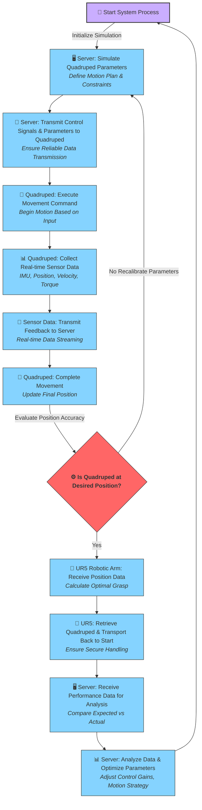

```mermaid
graph TD;
    A[🔄 Start System Process] -->|Initialize Simulation| B
    B[🖥️ Server: Simulate Quadruped Parameters<br/><i>Define Motion Plan & Constraints</i>] --> C
    C[📡 Server: Transmit Control Signals & Parameters to Quadruped<br/><i>Ensure Reliable Data Transmission</i>] --> D
    D[🤖 Quadruped: Execute Movement Command<br/><i>Begin Motion Based on Input</i>] --> E
    E[📊 Quadruped: Collect Real-time Sensor Data<br/><i>IMU, Position, Velocity, Torque</i>] --> F
    F[📶 Sensor Data: Transmit Feedback to Server<br/><i>Real-time Data Streaming</i>] --> G

    G[📍 Quadruped: Complete Movement<br/><i>Update Final Position</i>] -->|Evaluate Position Accuracy| H

    H{⚙️ Is Quadruped at Desired Position?} 
    H -->|Yes| I
    H -->|No Recalibrate Parameters| B

    I[🤖 UR5 Robotic Arm: Receive Position Data<br/><i>Calculate Optimal Grasp</i>] --> J
    J[🤖 UR5: Retrieve Quadruped & Transport Back to Start<br/><i>Ensure Secure Handling</i>] --> K
    K[🖥️ Server: Receive Performance Data for Analysis<br/><i>Compare Expected vs Actual</i>] --> L
    L[📊 Server: Analyze Data & Optimize Parameters<br/><i>Adjust Control Gains, Motion Strategy</i>] --> A

    %% Styles for better visualization
    classDef startStyle fill:#CAAEFF,stroke:#333,stroke-width:2px;
    classDef processStyle fill:#85D3FF,stroke:#333,stroke-width:1px;
    classDef decisionStyle fill:#ff6666,stroke:#333,stroke-width:1px,font-weight:bold;
    
    class A startStyle;
    class B,C,D,E,F,G,I,J,K,L processStyle;
    class H decisionStyle;
```

