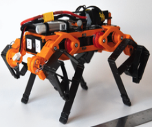
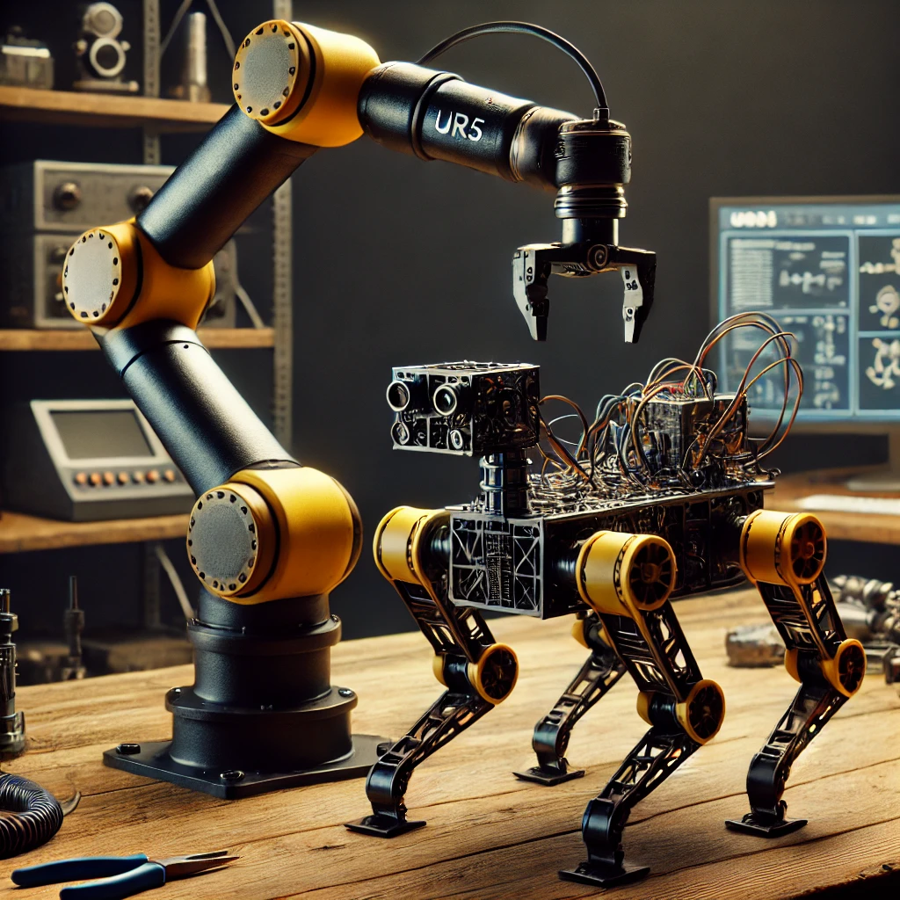

# Multi-Agent-Control-Quadruped-Meets-UR5

## **Project:** Fusion Robotics: A Quadruped-UR5 Robotics Testbed

**Team Number:**  
Team 01

**Team Members:**  

1. Jeevan Hebbal Manjunath
1. Yeshwanth Reddy Gurreddy
1. Aniruddha Anand Damle

**Semester and Year:**  
Spring 2025

**University, Class, and Professor:**  
- **University:** Arizona State University  
- **Class:** Experimentation and Deployment of Robotic Systems  
- **Professor:** Dr. Daniel M. Aukes

---

## 3. Project Plan

### 3.1 High-Level Concept and Research Question

Our project aims to integrate a UR5 robotic arm with a quadruped robot to facilitate advanced experimental setups. The central research question is: **"How effectively can sensor data and simulation models be integrated to enhance the real-time control and autonomy of a hybrid robotic system?"**  
The experiment involves using the UR5 to position the quadruped at a designated start point, triggering the quadruped to run in a specified direction, and collecting sensor data during its motion. We then broadcast this data to a server for analysis, comparing it with simulated data. The refined simulation results are subsequently applied back to the robot to evaluate improvements in performance forming a closed loop.

> **Figure 1:** _Quadraped Design_  
>   
> *Figure 1 illustrates the the design of quadruped, which is used for sensor data collection.*

### 3.2 Sensor Integration

Sensor integration is critical to our experimental setup. We plan to collect a range of sensor data (e.g., IMU, LIDAR, joint encoders) during the quadruped’s run. This data will be processed and filtered in real time to remove noise and extract meaningful features. In testing, sensors will validate both the starting position and the dynamic state of the quadruped. In the final demonstration, real-time sensor feedback will be used to adjust simulation parameters and fine-tune control algorithms, ensuring the robot operates optimally even under environmental variations.

### 3.3 Interaction and Interface Development

Interaction with the system will be two-fold:  
1. **Visualization & Monitoring:**  
   A user-friendly interface will display real-time sensor data, simulation comparisons, and status of hardware integration. This interface will allow operators to observe and intervene if necessary.  
2. **Data Storage and Interaction:**  
   The system will log all sensor data and simulation outputs for post-experiment analysis. This will enable retrospective analysis and adjustments to the simulation model.

> **Figure 2:** _Proposed Experimentation Components_  
>   
> *Figure 2 provides a rendering of our planned components (UR5 and Quadraped), illustrating quadraped and UR5.*

### 3.4 Control and Autonomy

To bridge sensor feedback with decision-making, we will integrate a control loop that uses sensor data to adjust the quadruped's trajectory in real time. The control architecture will be layered:
- **Low-Level Control:** Directly handles the robot's movement based on immediate sensor input.
- **High-Level Decision Making:** Utilizes simulation data to predict future states and modify control strategies dynamically.

This hierarchical approach ensures that both rapid responses and strategic planning are accommodated, increasing the robustness of the overall system.

### 3.5 Preparation Needs

Successful execution of this project requires a solid understanding of several topics:
- **Robotic Kinematics and Dynamics:** To accurately control the UR5 and quadruped.
- **Sensor Fusion Techniques:** To integrate and filter data from multiple sensor sources.
- **Control Systems and Autonomous Algorithms:** To design robust feedback loops.

Some of these topics will be reviewed in class; however, additional self-study and consultation with experts may be necessary to cover gaps, especially in advanced sensor fusion and real-time system integration.

### 3.6 Final Demonstration

Our final demonstration will showcase the complete integration and functioning of the hybrid robotic system:
- **Resources Required:**  
  - UR5 robotic arm and quadruped robot  
  - Sensor suite (IMU, LIDAR, encoders, etc.)  
  - High-performance computing for real-time data processing  
- **Classroom Setup Requirements:**  
  - A designated space for robotic operation with ample room for the quadruped to maneuver  
  - A projection system to display the interface and sensor data in real time  
- **Environmental Variability Handling:**  
  The system will be tested under different lighting, surface textures, and obstacle conditions to ensure that the control algorithms are robust enough to handle variability.
- **Testing & Evaluation Plan:**  
  Multiple test runs will be conducted to verify system performance. We will compare sensor data and simulation outputs against known benchmarks, ensuring that our control strategies adapt correctly to environmental changes.

### 3.7 Impact of the Work

This project has the potential to significantly enhance our understanding of real-time sensor integration and feedback control in hybrid robotic systems. By bridging experimental data with simulation, we expect to drive forward research in autonomous decision-making processes. Additionally, the project will provide valuable insights that can contribute to course development, encouraging further exploration into sensor fusion, control algorithms, and robotic autonomy.

### 3.8 Advising

Our project advisor will be **Dr. Daniel M. Aukes**, who has expressed willingness to provide mentoring and access to specialized hardware resources. Dr. Aukes' guidance will be pivotal in ensuring the project’s technical challenges are addressed effectively. His expectations include regular progress reports, adherence to project milestones, and active participation in troubleshooting sessions. Additional resources, such as access to the lab and advanced simulation tools, have been confirmed to support our experimental setup.

---

## 4. Weekly Milestones (Weeks 7-16)

Below is a table outlining our weekly milestones, covering hardware integration, interface development, sensor handling, and control/autonomy:

| **Week** | **Hardware Integration**                                                  |
|----------|---------------------------------------------------------------------------|
| **7**   | Initiate quadruped hardware setup; perform basic mobility tests           |
| **8**   | Continue quadruped calibration and mobility tuning                        |
| **9**   | Integrate UR5 for positioning the quadruped at the start point             |
| **10**  | Validate communication between UR5 and quadruped; adjust mounting and calibration |
| **11**  | Fine-tune mechanical alignment and sensor mounts                           |
| **12**  | Full hardware integration test with dynamic movements                      |
| **13**  | Begin integrated system tests (hardware + sensor + control)                |
| **14**  | Address hardware-software integration issues                               |
| **15**  | Final integration and system robustness testing                            |
| **16**  | Prepare hardware for final demonstration                                   |

---
*This document outlines our comprehensive plan for the project and serves as the foundation for our website’s main page. Each section details the essential aspects of the project, ensuring clarity in execution and evaluation.*